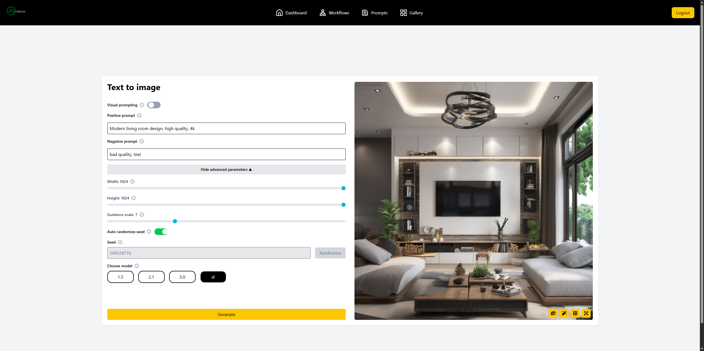

### AInterior
A team project developed for our engineering thesis. The application focuses on helping interior architects to use artificial intelligence models in their work.



### Features
- Many Stable Diffusion model versions to choose from
- Available workflows:
    * Text-to-image
    * Image-to-image
    * ControlNet
    * Inpainting
    * Outpainting
    * Canvas
- User accounts system with gallery, to store all created pictures, and administrator panel
- Many features to support architects:
    * Visual Prompting - visual representation of text prompts
    * Advanced parameter selection sheet
    * Easy switching between workflows
    * Prompt writing tutorial

### Techstack
- Backend: [Python](https://www.python.org/) + [FastAPI](https://github.com/fastapi/fastapi)
- Frontend: [React](https://github.com/facebook/react) + [Tailwind CSS](https://github.com/tailwindlabs/tailwindcss)
- Database: [MongoDB](https://github.com/mongodb/mongo?tab=readme-ov-file)
- Image generation: [Stable Diffusion](https://github.com/CompVis/stable-diffusion), [Hugging Face API](https://huggingface.co/settings/tokens), [Civit AI API](https://civitai.com/user/account), [Comfy UI](https://github.com/Comfy-Org/ComfyUI/tree/master)
- Containerization: [Docker](https://www.docker.com/)

## How to deploy

It is recommended to run this application on either native or wsl Ubuntu LTS 24.04.

### Hardware requirements

- **RAM:** 32 GB or more  
- **GPU:** NVIDIA RTX 2080 8GB / NVIDIA RTX 4060 8GB or better
- **Storage:** 1TB free disk space or more

### Preparation
1. Install docker with this instructions https://docs.docker.com/engine/install/ubuntu/ (In case of buildix issue: https://forums.docker.com/t/tips-for-how-to-fix-my-borked-cli-plugins/144327/3)

2. Install NVIDIA Container Toolkit  
    a. Add NVIDIA GPG key and repository

        curl -fsSL https://nvidia.github.io/libnvidia-container/gpgkey | \
        sudo gpg --dearmor -o /usr/share/keyrings/nvidia-container-toolkit-keyring.gpg
        curl -s -L https://nvidia.github.io/libnvidia-container/stable/deb/nvidia-container-toolkit.list | \
        sed 's#deb https://#deb [signed-by=/usr/share/keyrings/nvidia-container-toolkit-keyring.gpg] https://#g' | \
        sudo tee /etc/apt/sources.list.d/nvidia-container-toolkit.list

    b. Update package list

        sudo apt-get update

    c. Install the toolkit

        sudo apt-get install -y nvidia-container-toolkit

    d. Configure the runtime
        
        sudo nvidia-ctk runtime configure --runtime=docker
        sudo systemctl restart docker
        sudo nvidia-ctk runtime configure --runtime=containerd
        sudo systemctl restart containerd

3. Generate read only api token on https://huggingface.co/settings/tokens.

4. Generate api token on https://civitai.com/user/account.

5. In main directory create `api_keys.env` file with following contents:

    ```
    HF_TOKEN=<hf_api_token>
    CIVITAI_TOKEN=<civitai_api_token>
    ```
    
6. Run `sudo ./download_models.sh`to download all the models (This needs to be run only once)

4. Build & run (Use after making changes to the docker related files or when installing new packages/modules) FIRST RUN WILL TAKE A LONG TIME!!!:
    - Developement mode: `docker compose down && docker compose up --build`  
    or
    - Production mode: `docker compose down && docker compose -f docker-compose-production.yml up --build -d`

5. Run:
    - Developement mode: `docker compose down && docker compose up`  
or
    - Production mode:`docker compose down && docker compose -f docker-compose-production.yml up -d`

### How to forward frontend via ssh (For AGH University of Krakow users):
1. ssh -L 80:localhost:80 -J <login_bastion>@bastion.ii.agh.edu.pl <login_pc>@<ip_pc>

### How to run tests

1. ``` cd frontend ```
2. ```  sudo apt install npm ```
3. ``` npm run test:ui ``` or ``` npm run test ```